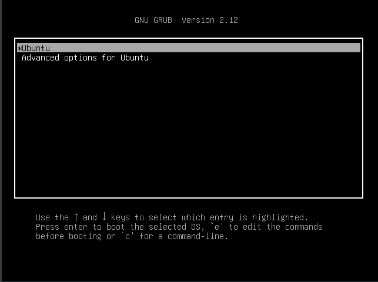
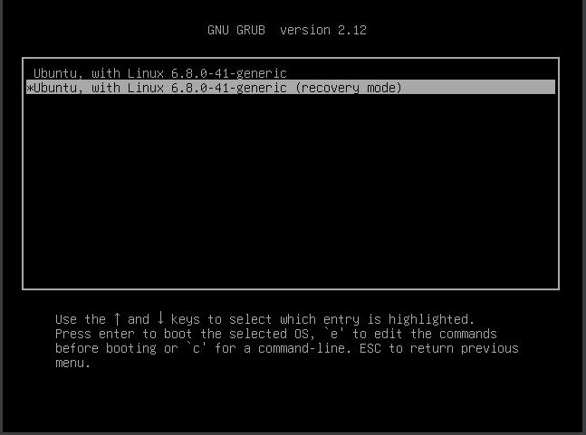
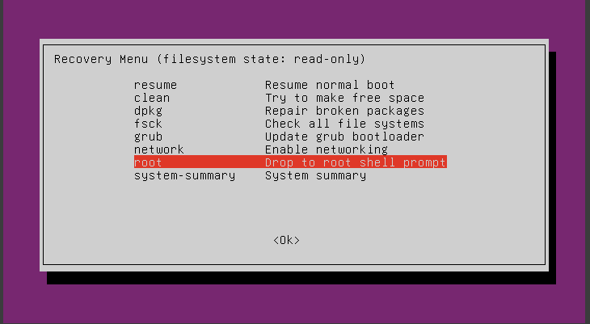
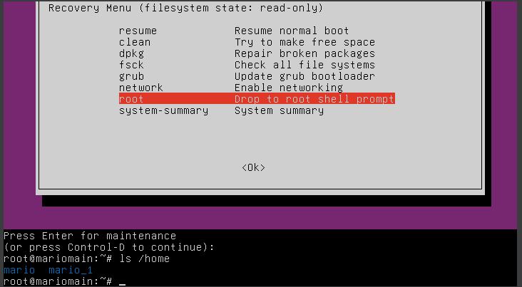
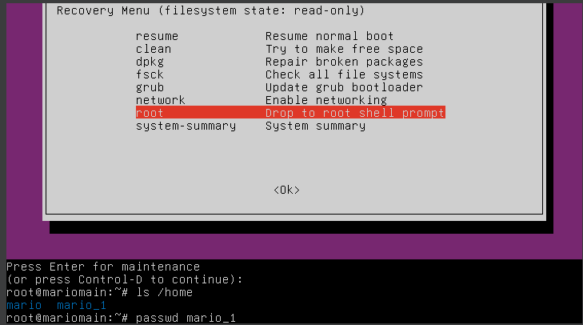
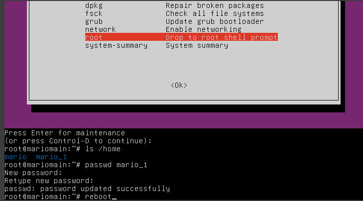
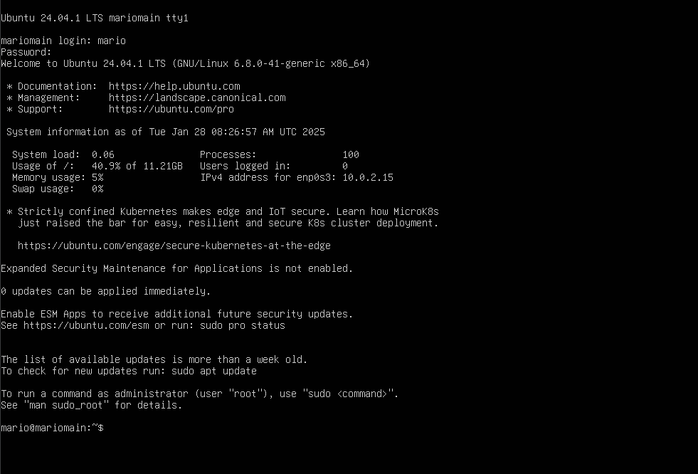

### Ubuntu Server Bypass

--------------------------------------------------------
  

## ES : BYPASS O RECUPERACION DE CONTRASEÑA EN SERVIDOR UBUNTU SIN INTERFAZ

**Contexto:** Se os ha olvidado vuestra contraseña y no podeis iniciar sesion. Lo que vamos a hacer en este tutorial es cambiar la contraseña desconocida por una nueva que si recordaremos.
Simplemente seguir los pasos 

En el ejemplo mio, recupero la contraseña de el usuario mario_1 

## EN: BYPASS UBUNTU SERVER WITHOUT INTERFACE          

**Context:** You have forgotten your password and cannot log in. What we are going to do in this tutorial is change the unknown password for a new one that we will remember. 

Just follow the steps In my example, recover the password of the user mario_1

--------------------------------------------------------

1.    Click
     

2.   Click
    

3.   Click
   

        
4.   ls /home para ver los usuarios de la maquina.            /  	 	 ls /home to see the machine users 
     

 
5.   Cambiar la contraseña desconocida  	/ 	 Change uknown Password
     

 

6.   Reiniciar 	/	  Reboot
     

 
7.  Iniciar Sesion	 / 	 Login 
    

 

10. Iniciar Sesion	 / 	Login
   

 
